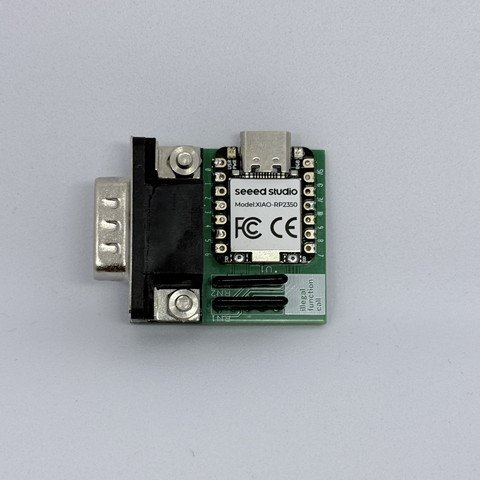
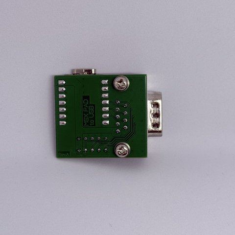
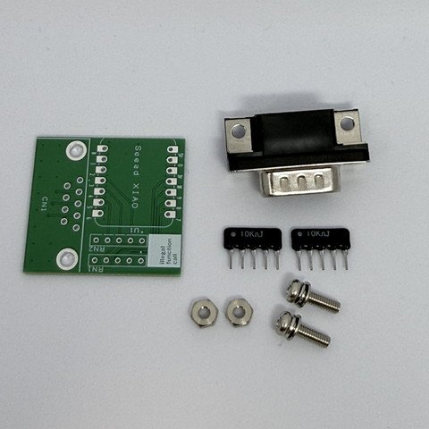

# 俺はMSX用ゲームパッドをUSBで使いたいんじゃ<br>for Seeed Studio XIAO RP2350<br>(MSXPAD2USB)





MSX用ゲームパッドの方向キーと2ボタンを、USB HIDゲームパッドへ変換するアダプタです。  
Seeed Studio XIAO RP2350を使って作りました。

USB側はDirectInput形式のゲームパッドとして動作します。  
とりあえず方向キーと2ボタンが普通に使えれば良い！！  
という、割り切った構成です。

USB DescriptorはHORI POKKEN CONTROLLER (`VID=0x0F0D`, `PID=0x0092`) になっているのでSWITCHで使えます。


## 特徴

- Seeed Studio XIAO RP2350を使用
- USB HID Game Padとして動作
- Hat Switchによる8方向入力
- 2ボタン入力
- 方向GPIOの上下同時押しでHOME、左右同時押しでZR
- BOOTSELボタンの押下中にLとRを同時送信
- 5ms周期でInput Reportを送信

## 添付品
 1. 専用PCB
 2. 集合抵抗 10Kx4
 3. D-SUB 9Pin コネクタ (ネジなど付属部品を含む)


 
マイコンボードは含まれません。speed XIAO-RP2350が別途必要です。秋月電子などで購入できます。  

https://wiki.seeedstudio.com/ja/getting-started-xiao-rp2350/

## フォルダー構成

```text
MSXPAD2USB/
├─ README.md
├─ firmware/
│  ├─ .vscode/                 VS Code設定とビルドタスク
│  ├─ src/                     ファームウェア本体
│  ├─ tinyusb-overrides/       TinyUSB 0.21.0用BUGFIX
│  ├─ uf2/                     書き込み用UF2
│  ├─ CMakeLists.txt
│  ├─ pico_sdk_import.cmake
│  └─ MSXPAD2USB.code-workspace
└─ schmatic/
   ├─ MSXPAD2USB.pdf           回路図
   ├─ sch.png                  回路図プレビュー
   ├─ pcb.png                  基板図面プレビュー
   └─ MSXPAD2USB - 2026-09-19.zip
                               Gerber／ドリルデータ
```

## XIAO RP2350との配線

ファームウェアと回路構成で使用する信号は下記の通りです。

| XIAO RP2350 GPIO | 方向 | 機能 | アクティブ状態 |
| :- | :- | :- | :- |
| GPIO1 | Input | Hat Switch 上 | LOW |
| GPIO2 | Input | Hat Switch 下 | LOW |
| GPIO3 | Input | Hat Switch 左 | LOW |
| GPIO4 | Input | Hat Switch 右 | LOW |
| GPIO5 | Input | Button 0（Switch A） | LOW |
| GPIO6 | Input | Button 1（Switch B） | LOW |
| GPIO7 | Output | 入力回路用LOW出力 | 常時LOW |

GPIO1～GPIO6は通常HIGH、操作時LOWです。  
RP2350側の内蔵プルアップ／プルダウンは使用していないため、未接続状態を含めて入力が浮かないように外部回路側でHIGHを維持してください。  
GPIO7は起動時にLOW出力へ設定され、そのままLOWを維持します。

SELECTはHOME、RUN/STARTはZRを送信します。  

### BOOTSELによるL＋R入力

Switchでは接続時にL+Rボタンを押す必要があるため、その機能をBOOTスイッチに割り当てています。


## 回路図

回路全体の結線、コネクタ番号および基板配線については、下記ファイルを参照してください。

- [回路図 PDF](./schmatic/MSXPAD2USB.pdf)
- [回路図 PNG](./schmatic/sch.png)
- [基板図面 PNG](./schmatic/pcb.png)
- [Gerber／ドリルデータ](./schmatic/MSXPAD2USB%20-%202026-09-19.zip)

## USB HID仕様

USB Device DescriptorおよびHID Report Descriptorは、下記HORIコントローラの情報を元にしています。

<https://github.com/progmem/Switch-Fightstick/blob/master/HORI_Descriptors>

| 項目 | 設定値 |
| :- | :- |
| Vendor ID | `0x0F0D` |
| Product ID | `0x0092` |
| Manufacturer | `HORI CO.,LTD.` |
| Product | `POKKEN CONTROLLER` |
| USB Version | USB 2.00 |
| HID Version | HID 1.11 |
| HID Report Descriptor | 90 bytes |
| Input Report | 8 bytes、Report IDなし |
| Output Report | 8 bytes、Report IDなし |
| Interrupt IN | Endpoint `0x81`、64 bytes、5ms |
| Interrupt OUT | Endpoint `0x02`、64 bytes、5ms |

Input Reportには13ボタン、Hat Switch、X/Y/Z/Rz軸、およびVendor-defined入力が定義されています。  
本機ではA、B、HOME、ZR、Hat SwitchをGPIOから、LとRをBOOTSELから更新し、X/Y/Z/Rz軸は中央値`0x80`、Vendor-defined入力は`0x00`を送信します。

### USBボタンのビット配置

`firmware/src/usb_descriptors.h`の`HORI_BUTTON_*`は、Input Reportの先頭2バイト（`uint16_t buttons`、リトルエンディアン）に適用するマスクです。ビット番号は0始まり、HID Button Usage番号は1始まりです。  
Switch側のラベルはユーザー提供の[NintendoSwitchControllのswitch_controller.h](https://github.com/interimadd/NintendoSwitchControll/blob/master/src/switch_controller.h)と照合済みです。bit 0～12の配置は[Switch-FightstickのJoystick.h](https://github.com/progmem/Switch-Fightstick/blob/master/Joystick.h)とも一致します。HID descriptor自体はButton Usage番号のみを定義し、Y/Bなどの名称は定義していません。実機Switchでの本ファームウェアの動作確認は別途必要です。

| bit | マスク | 定数 | Switch側の意味 / 用途 |
| :- | :- | :- | :- |
| 0 | `0x0001` | `HORI_BUTTON_Y` | Y（GPIO割当なし） |
| 1 | `0x0002` | `HORI_BUTTON_B` | B（GPIO6） |
| 2 | `0x0004` | `HORI_BUTTON_A` | A（GPIO5） |
| 3 | `0x0008` | `HORI_BUTTON_X` | X |
| 4 | `0x0010` | `HORI_BUTTON_L` | L（BOOTSEL） |
| 5 | `0x0020` | `HORI_BUTTON_R` | R（BOOTSEL） |
| 6 | `0x0040` | `HORI_BUTTON_ZL` | ZL |
| 7 | `0x0080` | `HORI_BUTTON_ZR` | ZR（GPIO3＋GPIO4） |
| 8 | `0x0100` | `HORI_BUTTON_MINUS` | −（SELECT） |
| 9 | `0x0200` | `HORI_BUTTON_PLUS` | ＋（START） |
| 10 | `0x0400` | `HORI_BUTTON_L_STICK` | 左スティック押し込み |
| 11 | `0x0800` | `HORI_BUTTON_R_STICK` | 右スティック押し込み |
| 12 | `0x1000` | `HORI_BUTTON_HOME` | HOME（GPIO1＋GPIO2） |
| 13 | `0x2000` | `HORI_BUTTON_RESERVED_13` | 予約 / 未使用、常に0 |
| 14 | `0x4000` | `HORI_BUTTON_RESERVED_14` | 予約 / 未使用、常に0 |
| 15 | `0x8000` | `HORI_BUTTON_RESERVED_15` | 予約 / 未使用、常に0 |

bit 0～12はHID Button Usage 1～13、bit 13～15は現行HORI descriptorの定数パディングです。両参照ヘッダーにはbit 13にCAPTUREという名称がありますが、本機のdescriptorには対応するButton Usageがないため、CAPTUREとしては定義・送信しません。ユーザー提供ライブラリの[switch_controller.cpp](https://github.com/interimadd/NintendoSwitchControll/blob/master/src/switch_controller.cpp)は16ボタンをDataとして定義しており、本機の13ボタン＋3パディングとは異なります。bit 14/15には参照ヘッダーにもボタン名がありません。GPIOに割り当てていない他のボタンも通常は0です。descriptorと8バイトのレポート形式は変更していません。

## Firmware書き込み方法

XIAO RP2350をBOOTモードにしてPCへ接続してください。  
上手く接続できればUSBドライブとして認識されます。

下記のコンパイル済みファイルをUSBドライブへドラッグ＆ドロップしたら完了です。

```text
firmware/uf2/MSXPAD2USB.uf2
```

書き込み後は自動的に再起動し、USBゲームパッドとして認識されます。

## Firmwareのビルド方法

### 必要な環境

- Raspberry Pi Pico SDK `2.3.0`
- Arm GNU Toolchain `15_2_Rel1`
- CMake
- Ninja
- VS Code
- Raspberry Pi Pico VS Code拡張機能
- インターネット接続（初回のTinyUSB取得時）

ボード定義にはPico SDK 2.3.0に含まれる`seeed_xiao_rp2350`を使用します。

### VS Codeからビルド

`firmware/MSXPAD2USB.code-workspace`をVS Codeで開きます。  
標準のビルドタスク`Build MSXPAD2USB`を実行すると、Configure後にファームウェアがビルドされます。

ビルドに成功すると、生成されたUF2は自動的に下記へコピーされます。

```text
firmware/uf2/MSXPAD2USB.uf2
```

### コマンドラインからビルド

`PICO_SDK_PATH`と`PICO_TOOLCHAIN_PATH`を環境に合わせて設定した後、`firmware`フォルダーで実行します。

```powershell
cmake -S . -B build -G Ninja `
  -DPICO_BOARD=seeed_xiao_rp2350 `
  -DPICO_SDK_PATH="$env:PICO_SDK_PATH" `
  -DPICO_TOOLCHAIN_PATH="$env:PICO_TOOLCHAIN_PATH"
cmake --build build
```

既存Debug設定で`CFG_TUSB_DEBUG`の二重定義エラーになる場合は、`cmake -S . -B build -DLOG=0`でTinyUSB側のログ設定を本ファームウェアの`0`に合わせてから、再度ビルドしてください。

## GPIOマッピングの回帰テスト

実機なしで全128入力状態（GPIO6本＋BOOTSEL）と全16384状態遷移を検証するホスト用テストを`firmware/tests/test_gamepad.c`に用意しています。ファームウェアの実際の入力処理をGPIO/USB/BOOTSELスタブで実行し、全16ビットのマスク、Hat、HOME/ZR/L/Rの押下・解除、A/Bとの併用、レポートのバイト配置、および周期送信とGET_REPORTの一致を検証します。BOOTSELが5ms周期以外やGET_REPORTから追加で読み取られず、周期外では保持値を使うことも確認します。RAM読取関数のMMIOや実機の電気的挙動、Switchでの認識は対象外です。

WindowsではMSVCのDeveloper PowerShellで、`firmware`フォルダーから実行できます（C11対応MSVC、ビルド済みの`build`フォルダーが必要）。

```powershell
cl /nologo /std:c11 /W4 /WX /Itests\stubs /Isrc `
  /Febuild\test_gamepad.exe /Fobuild\test_gamepad.obj tests\test_gamepad.c
if ($LASTEXITCODE -eq 0) { .\build\test_gamepad.exe }
```

## TinyUSBについて

RP2350で使用するTinyUSBはPico SDK付属版ではなく、CMakeの`FetchContent`でTinyUSB 0.21.0の固定リビジョンを取得します。

```text
dae3f9a366bfcddbf9dcf1b48d7500286a849539
```

取得したTinyUSBへ`firmware/tinyusb-overrides`以下のファイルを上書きし、RP2350 USB処理のBUGFIXを適用してからビルドします。  
Pico SDK本体やユーザー環境にインストールされたTinyUSBは直接変更しません。

## 回路図および基板データ

回路図、基板図面、製造用データは`schmatic`フォルダーにまとめてあります。

### 回路図


### 基板図面


基板を製造する場合は、`MSXPAD2USB - 2026-09-19.zip`内のGerberおよびドリルデータを使用してください。  
発注前には必ず回路図、基板寸法、穴位置、コネクタ向き、部品面を確認してください。

## 注意事項

- GPIO1～GPIO6には内蔵プル抵抗を設定していません。
- 入力は通常HIGH、操作時LOWになる外部回路を前提としています。
- GPIO7はLOW出力です。外部からHIGHを直接印加しないでください。

## ライセンス

本プロジェクトのライセンスは、MITライセンスになります。  
コードの一部にはRaspberry Pi Pico SDKおよびTinyUSB由来のコードを含みます。各依存ライブラリのライセンス条件にも従ってください。

## 使用したlibraryについて

本ソフトは下記libraryを利用しています。

### Raspberry Pi Pico SDK 2.3.0

<https://github.com/raspberrypi/pico-sdk>

### TinyUSB 0.21.0

<https://github.com/hathach/tinyusb>
