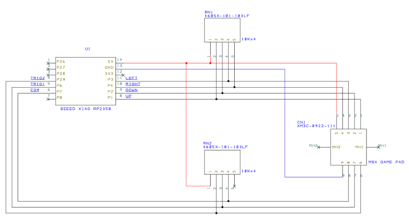
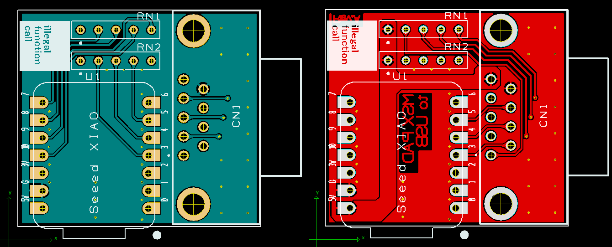

# 俺はMSX用ゲームパッドをUSBで使いたいんじゃ<br>for Seeed Studio XIAO RP2350<br>(MSXPAD2USB)





MSX用ゲームパッドの方向キーと2ボタンを、USB HIDゲームパッドへ変換するアダプタです。  
Seeed Studio XIAO RP2350を使って作りました。

USB側はDirectInput形式のゲームパッドとして動作します。  
USB DescriptorはHORI POKKEN CONTROLLER (`VID=0x0F0D`, `PID=0x0092`) の情報を元にしています。

とりあえず方向キーと2ボタンが普通に使えれば良い！！  
という、割り切った構成です。

## 特徴

- Seeed Studio XIAO RP2350を使用
- USB HID Game Padとして動作
- Hat Switchによる8方向入力
- 2ボタン入力
- 5ms周期でInput Reportを送信

## フォルダー構成

```text
MSXPAD2USB/
├─ README.md
├─ firmware/
│  ├─ .vscode/                 VS Code設定とビルドタスク
│  ├─ src/                     ファームウェア本体
│  ├─ tinyusb-overrides/       TinyUSB 0.21.0用BUGFIX
│  ├─ uf2/                     書き込み用UF2
│  ├─ CMakeLists.txt
│  ├─ pico_sdk_import.cmake
│  └─ MSXPAD2USB.code-workspace
└─ schmatic/
   ├─ MSXPAD2USB.pdf           回路図
   ├─ sch.png                  回路図プレビュー
   ├─ pcb.png                  基板図面プレビュー
   └─ MSXPAD2USB - 2026-09-19.zip
                               Gerber／ドリルデータ
```

※`schmatic`は現在の実フォルダー名に合わせています。

## XIAO RP2350との配線

ファームウェアと回路構成で使用する信号は下記の通りです。

| XIAO RP2350 GPIO | 方向 | 機能 | アクティブ状態 |
| :- | :- | :- | :- |
| GPIO1 | Input | Hat Switch 上 | LOW |
| GPIO2 | Input | Hat Switch 下 | LOW |
| GPIO3 | Input | Hat Switch 左 | LOW |
| GPIO4 | Input | Hat Switch 右 | LOW |
| GPIO5 | Input | Button 0 | LOW |
| GPIO6 | Input | Button 1 | LOW |
| GPIO7 | Output | 入力回路用LOW出力 | 常時LOW |

GPIO1～GPIO6は通常HIGH、操作時LOWです。  
RP2350側の内蔵プルアップ／プルダウンは使用していないため、未接続状態を含めて入力が浮かないように外部回路側でHIGHを維持してください。  
GPIO7は起動時にLOW出力へ設定され、そのままLOWを維持します。

上下が同時に入力された場合は上下ニュートラル、左右が同時に入力された場合は左右ニュートラルとして扱います。

回路全体の結線、コネクタ番号および基板配線については、下記ファイルを参照してください。

- [回路図 PDF](./schmatic/MSXPAD2USB.pdf)
- [回路図 PNG](./schmatic/sch.png)
- [基板図面 PNG](./schmatic/pcb.png)
- [Gerber／ドリルデータ](./schmatic/MSXPAD2USB%20-%202026-09-19.zip)

## USB HID仕様

USB Device DescriptorおよびHID Report Descriptorは、下記HORIコントローラの情報を元にしています。

<https://github.com/progmem/Switch-Fightstick/blob/master/HORI_Descriptors>

| 項目 | 設定値 |
| :- | :- |
| Vendor ID | `0x0F0D` |
| Product ID | `0x0092` |
| Manufacturer | `HORI CO.,LTD.` |
| Product | `POKKEN CONTROLLER` |
| USB Version | USB 2.00 |
| HID Version | HID 1.11 |
| HID Report Descriptor | 90 bytes |
| Input Report | 8 bytes、Report IDなし |
| Output Report | 8 bytes、Report IDなし |
| Interrupt IN | Endpoint `0x81`、64 bytes、5ms |
| Interrupt OUT | Endpoint `0x02`、64 bytes、5ms |

Input Reportには13ボタン、Hat Switch、X/Y/Z/Rz軸、およびVendor-defined入力が定義されています。  
本機ではButton 0、Button 1、Hat SwitchをGPIOから更新し、X/Y/Z/Rz軸は中央値`0x80`、Vendor-defined入力は`0x00`を送信します。

## Firmware書き込み方法

XIAO RP2350をBOOTモードにしてPCへ接続してください。  
上手く接続できればUSBドライブとして認識されます。

下記のコンパイル済みファイルをUSBドライブへドラッグ＆ドロップしたら完了です。

```text
firmware/uf2/MSXPAD2USB.uf2
```

書き込み後は自動的に再起動し、USBゲームパッドとして認識されます。

## Firmwareのビルド方法

### 必要な環境

- Raspberry Pi Pico SDK `2.3.0`
- Arm GNU Toolchain `15_2_Rel1`
- CMake
- Ninja
- VS Code
- Raspberry Pi Pico VS Code拡張機能
- インターネット接続（初回のTinyUSB取得時）

ボード定義にはPico SDK 2.3.0に含まれる`seeed_xiao_rp2350`を使用します。

### VS Codeからビルド

`firmware/MSXPAD2USB.code-workspace`をVS Codeで開きます。  
標準のビルドタスク`Build MSXPAD2USB`を実行すると、Configure後にファームウェアがビルドされます。

ビルドに成功すると、生成されたUF2は自動的に下記へコピーされます。

```text
firmware/uf2/MSXPAD2USB.uf2
```

### コマンドラインからビルド

`PICO_SDK_PATH`と`PICO_TOOLCHAIN_PATH`を環境に合わせて設定した後、`firmware`フォルダーで実行します。

```powershell
cmake -S . -B build -G Ninja `
  -DPICO_BOARD=seeed_xiao_rp2350 `
  -DPICO_SDK_PATH="$env:PICO_SDK_PATH" `
  -DPICO_TOOLCHAIN_PATH="$env:PICO_TOOLCHAIN_PATH"
cmake --build build
```

## TinyUSBについて

RP2350で使用するTinyUSBはPico SDK付属版ではなく、CMakeの`FetchContent`でTinyUSB 0.21.0の固定リビジョンを取得します。

```text
dae3f9a366bfcddbf9dcf1b48d7500286a849539
```

取得したTinyUSBへ`firmware/tinyusb-overrides`以下のファイルを上書きし、RP2350 USB処理のBUGFIXを適用してからビルドします。  
Pico SDK本体やユーザー環境にインストールされたTinyUSBは直接変更しません。

## 回路図および基板データ

回路図、基板図面、製造用データは`schmatic`フォルダーにまとめてあります。

### 回路図


### 基板図面


基板を製造する場合は、`MSXPAD2USB - 2026-09-19.zip`内のGerberおよびドリルデータを使用してください。  
発注前には必ず回路図、基板寸法、穴位置、コネクタ向き、部品面を確認してください。

## 注意事項

- GPIO1～GPIO6には内蔵プル抵抗を設定していません。
- 入力は通常HIGH、操作時LOWになる外部回路を前提としています。
- GPIO7はLOW出力です。外部からHIGHを直接印加しないでください。

## 使用したlibraryについて

本ソフトは下記libraryを利用しています。

### Raspberry Pi Pico SDK 2.3.0

<https://github.com/raspberrypi/pico-sdk>

### TinyUSB 0.21.0

<https://github.com/hathach/tinyusb>

